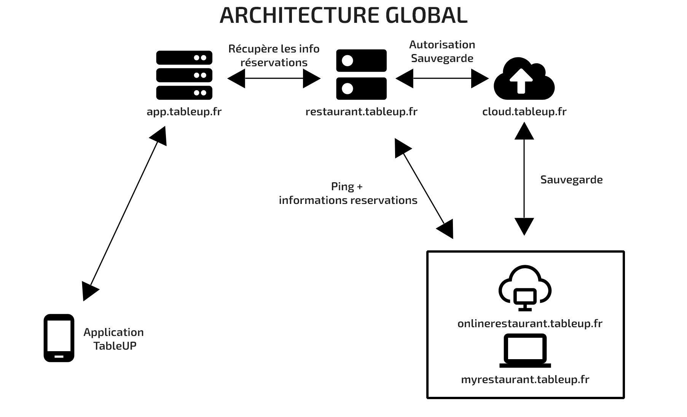

    

Le projet **TableUP** a pour vocation d'être un <u>système de restauration</u> incluant la gestion du restaurant pour les restaurateurs et une application mobile utilisée par les clients qui veulent chercher et réserver un restaurant.

Les fonctionnalités finales sont : 
- **Gestion du restaurant** avec 2 modes de fonctionnements : 
    - ☁️ Solution dans le cloud
    - 💻 Solution en local chez le restaurateur
- **Cloud backup** utilisé pour sauvegarder les données des restaurateurs
- **Application de recherche et réservation** de restaurant pour les clients
- **Le service central** qui relie et met à disposition les informations pour réserver

> ℹ️ *La réservation sera possible à partir de l'application, par Google Maps et sur un site en direct*

➡️ **La version 1 ne prévoit que la partie restaurateur pour le moment**

## Stack technique

Application restaurateur : 

> *Code disponible dans `source\TURO`*

- Angular v22
- TypeScript
- C# 
- ASP.NET Core v10
- Entity Framework Core v10
- PostgreSQL
